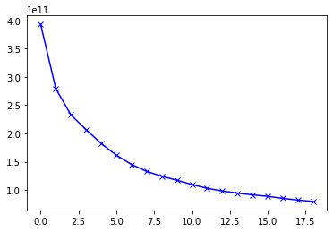
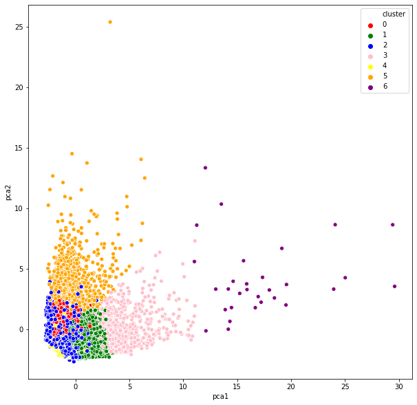
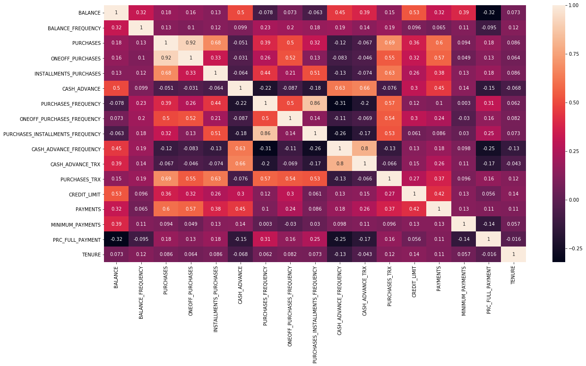

# Customer Market Segmentation

Machine Learning applications are unlocking value across business functions. 
This project deals with Customer Market Segmentation using Unsupervised Learning Models.
It is crucial for maximizing marketing campaign conversion rate. This can be achieved by targeted marketing that is tailored to a specific group of customers.

The unsupervised learning models used in this project are K-means Clustering and Principal Component Analysis(PCA).

# K-means Clustering:

K-Means clustering works by grouping observations with similar attribute values together by measuring the distance between the data points. For this project, I have
used Euclidean Distance. Identifying the optimal number of clusters, i.e, 'K' can be tricky. This has been addressed by using the Elbow Method.

The point at which the curve starts to become relatively linear gives the optimal value of 'K'.

# Principal Component Analysis (PCA):

PCA performs dimensionality reduction while attempting at keeping the information unchanged. It works by identifying new features, called components which are composites 
of the uncorrelated given input features.

# Dataset
The Credit Card Dataset was used, the link for which is https://www.kaggle.com/arjunbhasin2013/ccdata
The dataset summarizes the usage behavior of about 9000 active credit card holders during a period of 6 months. The file is at a customer level with 18 behavioral variables.

The variables are:
CUSTID: Identification of Credit Card holder  
BALANCE: Balance amount left in customer's account to make purchases  
BALANCE_FREQUENCY: How frequently the Balance is updated, score between 0 and 1 (1 = frequently updated, 0 = not frequently updated)  
PURCHASES: Amount of purchases made from account  
ONEOFFPURCHASES: Maximum purchase amount done in one-go  
INSTALLMENTS_PURCHASES: Amount of purchase done in installment  
CASH_ADVANCE: Cash in advance given by the user  
PURCHASES_FREQUENCY: How frequently the Purchases are being made, score between 0 and 1 (1 = frequently purchased, 0 = not frequently purchased)  
ONEOFF_PURCHASES_FREQUENCY: How frequently Purchases are happening in one-go (1 = frequently purchased, 0 = not frequently purchased)  
PURCHASES_INSTALLMENTS_FREQUENCY: How frequently purchases in installments are being done (1 = frequently done, 0 = not frequently done)  
CASH_ADVANCE_FREQUENCY: How frequently the cash in advance being paid  
CASH_ADVANCE_TRX: Number of Transactions made with "Cash in Advance"  
PURCHASES_TRX: Number of purchase transactions made  
CREDIT_LIMIT: Limit of Credit Card for user  
PAYMENTS: Amount of Payment done by user  
MINIMUM_PAYMENTS: Minimum amount of payments made by user   
PRC_FULL_PAYMENT: Percent of full payment paid by user  
TENURE: Tenure of credit card service for user  

The correalation matrix of the data is given below:

